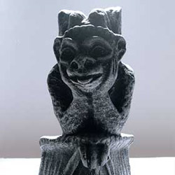
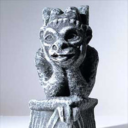
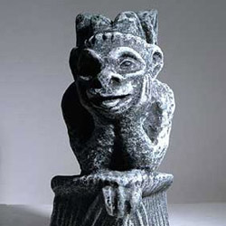

## Multiple Synthetic Lights

Multiple photographs taken with different light sources can be blended together to create images that appear to have all the light sources simultaneously active. The light sources can be attributed arbitrary colors as well, allowing the creation of an infinite number of synthetic scenes.

Quoting from [Synthetic Lighting for Photography](https://www.graficaobscura.com/synth/) by Paul Haeberli:

> Light from different light sources add together to illuminate objects in a scene. We can use this super-position principle to modify the lighting of a scene after it has been photographed...

I've created an interactive application with three light sources with different colors.

<main>
</main>
{: .center}

Hover over the image to change the intensities of the three light sources.

This was originally done using [Processing](https://processing.org/), then ported to Processing.js (deprecated) and I've recently ported it to [p5.js](https://p5js.org/) with GPT-4. You can download the original [PDE file](multi_focus.pde) or the ported [p5.js file](sketch.js).

The images I've used are below. They're taken from the ["Lighting direction" article](http://www.megapixel.net/html/articles/article-lightdir.php).

{: .center}

{: .center}

{: .center}

{: .center}

