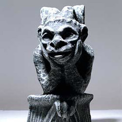

## Multiple Synthetic Lights

Multiple photographs taken with different light sources can be blended together to create images that appear to have all the light sources simultaneously active. The light sources can be attributed arbitrary colors as well, allowing the creation of an infinite number of synthetic scenes.

Quoting from [Synthetic Lighting for Photography](http://www.graficaobscura.com/synth/) by Paul Haeberli:

> Light from different light sources add together to illuminate objects in a scene. We can use this super-position principle to modify the lighting of a scene after it has been photographed...

I've created an interactive application with three light sources with different colors.

  
  <canvas data-processing-sources="multi_light.pde" width="250" height="250"></canvas>

Hover over the image to change the intensities of the three light sources.

This was done using [Processing.js](http://processingjs.org/). You can download the [PDE file](multi_light.pde).

The original images I used are below. <del>I had snatched them a while ago from a search result on Google Images but I can't find the actual source anymore. So, this will have to go without credit. Please drop me a comment if you know the source of these images.</del> <ins>They're from the ["Lighting direction" article](http://www.megapixel.net/html/articles/article-lightdir.php) at [megapixel.net](http://www.megapixel.net/). I've submitted a belated request for permission to use these images in this article and I'm waiting for their response.</ins>

{: .center }

{: .center }

{: .center }

{: .center }
