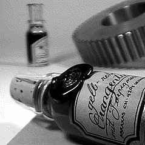

Two (or more) photographs of the same scene and that have different focal distances can be joined together to create an image where both distant and close objects can be in focus.

Quoting from [A Multifocus Method for Controlling Depth of Field](https://www.graficaobscura.com/depth/index.html) by Paul Haeberli:

> When a photograph is taken with a camera, the lens is focused at a particular distance. Objects nearer or farther than this focal distance will appear blurred. By changing the focus of the lens, near objects or distant objects can be made to appear in sharp focus. If you want to create an image where distant objects as well as close objects are in focus, two or more images can be merged together to make an image with increased depth of field...

Instead of creating a single, in-focus image from two images, I wanted to see how a smooth morphing effect would look like.

Hovering over the image controls how much each of the two images contributes to the final image. Vertical movement controls the contribution amount of the image where the bottle at the front in-focus. Horizontal movement controls the image where the bottle at the back is in-focus.

To get a natural, focus-back-and-forth experience, move the mouse from the top right corner to the bottom left corner and back.

  <canvas id="canvas" class="black" width="239" height="239" style="cursor: crosshair;"></canvas>

<!--
This was originally done using [Processing](https://processing.org/), then ported to Processing.js (deprecated) and I've recently ported it to [p5.js](https://p5js.org/) with GPT-4. You can download the original [PDE file](multi_focus.pde) or the ported [p5.js file](sketch.js).
-->

The images I've used are below. They're taken from the original article.

  

  

