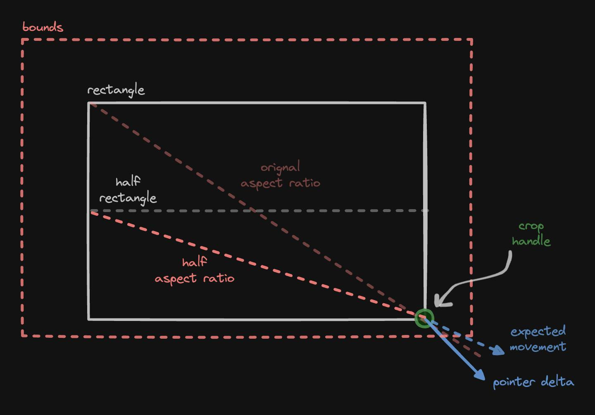

The movement constraints of all 8 drag handles of a crop rectangle can be implemented by reusing the implementation of one corner.

### The complexity of a crop rectangle

Oh man. Have you ever tried implementing a draggable crop rectangle from scratch? To give it all the flexibility you'd expect from a mature crop rectangle implementation there are many constraints to solve:

- Drag the rectangle itself around by starting the dragging inside. Keep the rectangle inside the image. This is the easiest to implement.
- Resize the rectangle by dragging any of the four corner drag handles. Each drag handle changes different properties of the rectangle:
  - Top left changes the x, y, width, and height.
  - Top right changes the y, width, and height.
  - Bottom left changes the x, width, and height.
  - Bottom right only changes the width and height.
  - Keep the corners inside the image.
- Resize the rectangle by dragging any of the four side drag handles. Again, each drag handle changes different properties of the rectangle. Keep the sides inside the image.
- Don't allow the rectangle to go smaller than a minimum width and height.
- Easy so far.
- Now add optional aspect ratio enforcement while doing all of the above.
- Make the aspect-ratio-enforced dragging feel natural instead of letting the handles jump around weirdly while trying to follow weird pointer movements. (Solution: project the pointer movement delta vector onto the aspect ratio vector.)
- Corner drag handles should stay within the image by smartly clamping their x/y coordinates to obey the aspect ratio enforcement.
- Side drag handles move the sides, but actually move the two adjacent corners symmetrically. Now we have not one but two corners to simultaneously keep inside the image while enforcing the aspect ratio.

### Looking at things from a different angle

What do the four corner drag handles have in common? They're the same corner if you tilt your head at increments of 90 degrees. So all I had to do was to rotate the frame of reference by the appropriate multiple of 90 degrees, apply corner logic for only one of the corners, and rotate back the frame of reference. And which corner do we pick? The simplest one, of course. The bottom right corner only changes the width and height of the rectangle!

Here's all that's involved in implementing the bottom right corner drag handle:

<p class="center zoomable">
  
</p>

1. From the pointer down to the pointer move event, get the pointer movement delta vector: (dx, dy).
2. Project the pointer delta vector onto the aspect ratio vector: (width, height).
3. Clamp the projected vector to the image boundaries while preserving aspect ratio.

And the frame of reference rotation trick for the bottom right corner looks like this:

<p class="center zoomable">
  
</p>

Once we have a moveCorner method that handles the bottom right corner, and a withFrameOfReference wrapper, the implementation of e.g. the top right corner becomes just:

```js
export const moveTopRightCorner = withFrameOfReference(moveCorner, Math.PI / 2);
```

The corners are reduced to a single corner problem.

### Reflecting on things

What about the sides? A side drag handle can be seen as not dragging the side at all, but causing the dragging of the two adjacent corners while preserving the overall aspect ratio of the rectangle. There's symmetry across the middle.

<p class="center zoomable">
  
</p>

If we forget about the two corners and the symmetry among them, and just focus on one of the corners, we're back to just dealing with the same old bottom right corner.

Here's the first tweak. We have yet another frame of reference: We're now operating in a squished coordinate system. The aspect ratio that we enforce on the drag handle is half of the original aspect ratio: (width, height / 2):

<p class="center zoomable">
  
</p>

However, there's another edge case (oh, the puns!) that we must deal with. The bottom right corner might be free to move vertically more then it's top right counterpart:

<p class="center zoomable">
  
</p>

To overcome this issue, here's the second tweak. We reflect the bounding rectangle (the rectangle representing the image itself) along the axis of symmetry and then intersect the two bounding rectangles to derive a smaller bounding rectangle that keeps both corners within the image:

<p class="center zoomable">
  
</p>

Once we have a moveEdge method that internally uses the moveCorner method, we put our withFrameOfReference wrapper to good use to implement all side drag handles:

```js
export const moveTopEdge = withFrameOfReference(moveEdge, Math.PI / 2);
```

### Not a corner problem

One last piece of the puzzle is to prevent the crop rectangle from being shrunk beyond dimensions that would break the UX. To do this, the only thing we need to do is to clip the bounding rectangle:

<p class="center zoomable">
  
</p>

### But so much math!

This is one of those problem domains where throwing conditional logic (e.g. a boatload of if statements) might have done the job. Might. I doubt it, because there's only so much you can do by sidestepping vector math in a vector problem domain. Also, reduction of this problem to a few math principles allows us to just rely on well-established math.

Another advantage of the reduction of all drag handles into a single corner drag handle problem is, if the implementation of the bottom right corner is right, then everything else is right. You will not find a bug with any of the 8 drag handles if you can't find a bug with the bottom right corner!

We now only have a single corner problem!
