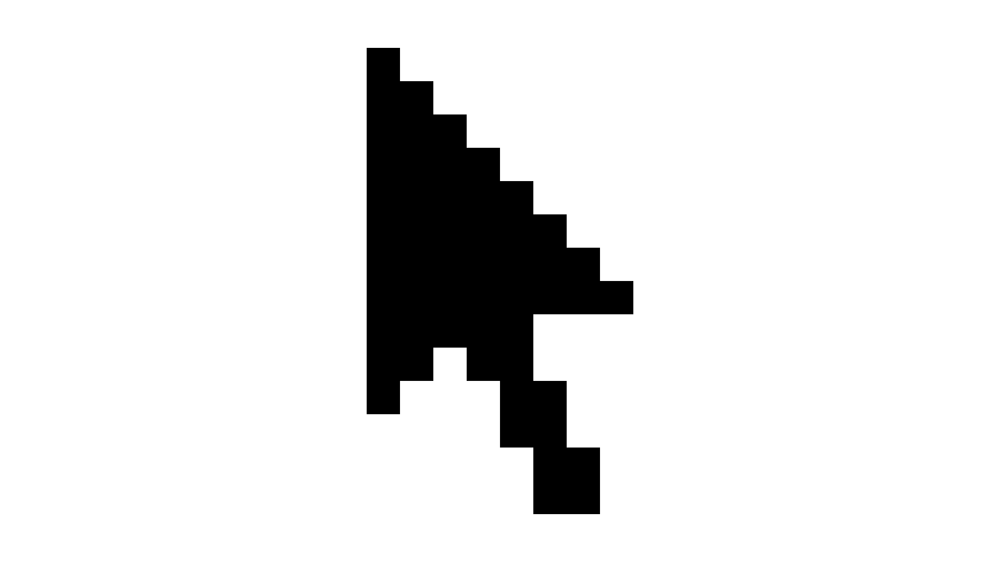

This is a breakdown of one of my [older dweets][1], introducing a dweet
rendering technique and a few general JavaScript golfing techniques.

It's a follow-up to:

1. [A Short Introduction to Dwitter and JavaScript Golfing][2]
2. [Dweeting Outside the Box][3]

[1]: https://www.dwitter.net/d/3271
[2]: /posts/2024-12-20-intro-to-dwitter
[3]: /posts/2024-12-25-dweeting-outside-the-box

### The subject

Suppose we want to render a specific bitmap image in a Dweet. As an example,
I'll nostalgically pick the mouse pointer icon of the TOS operating system on
the Atari ST:

<p class="center">
  
</p>

It's a 16x16 icon, but the bounding box of the black pixels are 8x14, so we can
ignore pixel information that falls outside.

The raw binary data to encode this information looks like this:

```
10000000
11000000
11100000
11110000
11111000
11111100
11111110
11111111
11111000
11011000
10001100
00001100
00000110
00000110
```

If you squint, you should be able to make out the mouse pointer.

In its raw form these ones and zeroes would take up `8 * 14 = 112` characters,
not leaving much room in a 140-character dweet to incorporate code to actually
render the pixels.

### Encoding, with a problem

Let's start with packing each of the rows into a byte. I'll prefix each row with
`0b` to turn it into a binary number literal:

```
const bytes = [
  0b10000000,
  0b11000000,
  0b11100000,
  0b11110000,
  0b11111000,
  0b11111100,
  0b11111110,
  0b11111111,
  0b11111000,
  0b11011000,
  0b10001100,
  0b00001100,
  0b00000110,
  0b00000110,
];
```

This is equivalent to:

```js
const bytes = [128, 192, 224, 240, 248, 252, 254, 255, 248, 216, 140, 12, 6, 6];
```

We can now use `String.fromCharCode()` to turn each number into characters and
then concatenate them:

```js
const bytes = [128, 192, 224, 240, 248, 252, 254, 255, 248, 216, 140, 12, 6, 6];
const encoded = bytes.map((c) => String.fromCharCode(c)).join('');
```

This is what we get:

<pre><code class="language-js">const encoded = '<span class="remove">\x80</span>ÀàðøüþÿøØ<span class="remove">\x8C\f\x06\x06</span>';
</code></pre>

But note the extra baggage of the escaped characters in `\x##` form. Instead of
single characters, they're all encoded as 4 characters. There's also the `\f`
form feed character.

Depending on the size and content of the bitmap, you may get none, but you could
also get a lot of these escape sequences. They take up precious space.

And when the bitmap size is wider than 8 pixels, you may venture into the much
more verbose Unicode code point sequences, `\u####`.

### More efficient encoding

We can get around this by adding an offset to the character codes to put them
within `0x0000` through `0xFFFF`: Characters within the Basic Multilingual Plane
(BMP) don't require escaping except:

| Values              | Designation           |
| ------------------- | --------------------- |
| `0` through `31`    | C0 control characters |
| `127`               | Delete character      |
| `128` through `159` | C1 control characters |

Keep in mind that `fromCharCode()` only works with BMP. We can't go beyond 16
bits (or bitmap columns). There's `fromCodePoint()` to go past BMP, but I won't
get into that.

So, if we add `160` to the bit-packed value, we'll make sure we stay within the
range that doesn't require escaping:

```js
const bytes = [128, 192, 224, 240, 248, 252, 254, 255, 248, 216, 140, 12, 6, 6];
const encoded = bytes.map((c) => String.fromCharCode(c + 160)).join('');
```

This is what we get:

```js
const encoded = 'ĠŠƀƐƘƜƞƟƘŸĬ¬¦¦';
```

Nothing escaped!

### Initial render

Let's render our bitmap using 8x8 squares.

We will pluck the character corresponding to the whole encoded row with
`charCodeAt(Y)` and then test the bit corresponding to pixel at `X` by AND'ing
with a bitmask we obtain by left-shifting `1` by `X` places.

In verbose form, that's `(encoded.charCodeAt(Y) - 160) & (1 << X)`, but we can
exploit operator precedence at the expense of human readability to make it much
shorter: `encoded.charCodeAt(Y)-160&1<<X`:

<pre class="dweet play"><code class="language-js">c.width|=0
for(Y=14;Y--;)for(X=8;X--;)'ĠŠƀƐƘƜƞƟƘŸĬ¬¦¦'.charCodeAt(Y)-160&1&lt;&lt;X&&x.fillRect(X*8,Y*8,8,8)
</code></pre>

That didn't quite work as expected because the X axis loop is reversed to save
space. Instead of reversing that loop or replacing the bit accessor `i` with
`7-i` and wasting space, we can simply flip our image data before encoding.

By doing more preparation outside of the dweet, we save space within.

### More preparation

Mouse pointer icon flipped on the X axis and encoded again:

```
const bytes = [
  0b00000001,
  0b00000011,
  0b00000111,
  0b00001111,
  0b00011111,
  0b00111111,
  0b01111111,
  0b11111111,
  0b00011111,
  0b00011011,
  0b00110001,
  0b00110000,
  0b01100000,
  0b01100000,
];
const encoded = bytes.map((c) => String.fromCharCode(c + 160)).join('');
```

We get:

```
encoded = '¡£§¯¿ßğƟ¿»ÑÐĀĀ';
```

And then we can render the icon facing the right way with no extra code:

<pre class="dweet play"><code class="language-js">c.width|=0
for(Y=14;Y--;)for(X=8;X--;)'¡£§¯¿ßğƟ¿»ÑÐĀĀ'.charCodeAt(Y)-160&1&lt;&lt;X&&x.fillRect(X*8,Y*8,8,8)
</code></pre>

### Wait a minute...

If we can add some offset, 160, to get us past the C1 block, what stops us from
making this offset a power of 2? Since we're doing binary masking to test bits,
we're already ignoring any bits that fall outside our most significant bit.
Let's go up to next power of 2 that's larger than 160: `256`.

```
const bytes = [
  0b00000001,
  0b00000011,
  0b00000111,
  0b00001111,
  0b00011111,
  0b00111111,
  0b01111111,
  0b11111111,
  0b00011111,
  0b00011011,
  0b00110001,
  0b00110000,
  0b01100000,
  0b01100000,
];
const encoded = bytes.map((c) => String.fromCharCode(c + 256)).join('');
```

We get:

```
encoded = 'āăćďğĿſǿğěıİŠŠ';
```

And we gloriously save 4 characters by omitting the `-256` subtraction:

<pre class="dweet play"><code class="language-js">c.width|=0
for(Y=14;Y--;)for(X=8;X--;)'āăćďğĿſǿğěıİŠŠ'.charCodeAt(Y)&1&lt;&lt;X&&x.fillRect(X*8,Y*8,8,8)
</code></pre>

### Loop collapse

A JavaScript golfing technique that can **sometimes** save space: Joining two
nested loops into one.

We can loop over all 112 pixels and then compute the `X` and `Y` values.

For `Y`, the verbose way would be dividing the iterator `i` with the number of
columns and flooring the value: `Math.floor(i/8)`. We can also exploit binary
operators to coerce the result into an integer: `i/8|0`. However, since in this
case we're lucky enough to have exactly 8 columns, we can simply bit-shift the
value by 3 bits: `i>>3`.

For `X`, a modulo would work: `X=i%8`. However, since 8 is a power of two, we
can use a binary AND with 7 to the same effect: `X=i&7`. It's symmetrical with
our use of bit shifting for `Y` and it also truncates the result in case `i`
were to be not an integer &mdash; something modulo doesn't provide.

When you have creative freedom in picking dimensions in a dweet, sticking to
powers of 2 can yield savings.

Here's the collapsed loop version:

<pre class="dweet play"><code class="language-js">c.width|=0
for(i=112;i--;'āăćďğĿſǿğěıİŠŠ'.charCodeAt(Y=i>>3)&1&lt;&lt;X&&x.fillRect(X*8,Y*8,8,8))X=i&7
</code></pre>

Note that we're now using the "final expression" slot of the `for` loop to do
the rendering. This slot doesn't have to be only used for
incrementing/decrementing a loop variable. We've left the `X=i&7` assigned
within the loop because we then don't have to create an empty loop body with a
`;` character and we don't need to use a `,` operator with the final expression.

Also note a common trick where we can store the value of an expression while we
use it for the first time, as in `charCodeAt(Y=i>>3)`.

Just saved 2 characters, but it's worth it!

### When you have extra space

Since we still have a **whopping 44 characters** until the 140 character limit,
we can throw in some fun.

Mouse hijack!

<pre class="dweet play"><code class="language-js">c.width|=0
for(i=112;i--;'āăćďğĿſǿğěıİŠŠ'.charCodeAt(Y=i>>3)&1&lt;&lt;X&&x.fillRect(X*8+(S(t*3.1)**5+1)*960,Y*8+(C(t*5.3)**7+1)*540,8,8))X=i&7
</code></pre>

Some final tricks that are used in the above:

1. Add `1` and divide by `2` sine and cosine values to let them go between `0`
   and `1` instead of `-1` and `1`. Though, in the above, I'm not dividing by 2
   but multiplying by half the extents of the canvas to save space.
2. Raise values to powers less then 1 to dampen and more than 1 to excite
   motion. I obtain the jolty motion by the `**5` and `**7`.
3. Multiply angles with primes or "weird" values to prevent the motion to have a
   short loop cycle. The curves will take a long time converging back on their
   starting positions thanks to the `*3.1` and `*5.3`.

<!--
<pre class="dweet play"><code class="language-js">c.width|=0
s=64
x.fillStyle='white';x.fillRect(0,0,1920,1080)
x.fillStyle='black'
for(j=14;j--;)for(i=8;i--;)'ŁŃŇŏşſƿȿşśűŰƠƠ'.charCodeAt(j)-320&1&lt;&lt;i&&x.fillRect(i*64+(c.width-8*s)/2,j*64+(c.height-14*s)/2,64,64)
</code></pre>
-->
