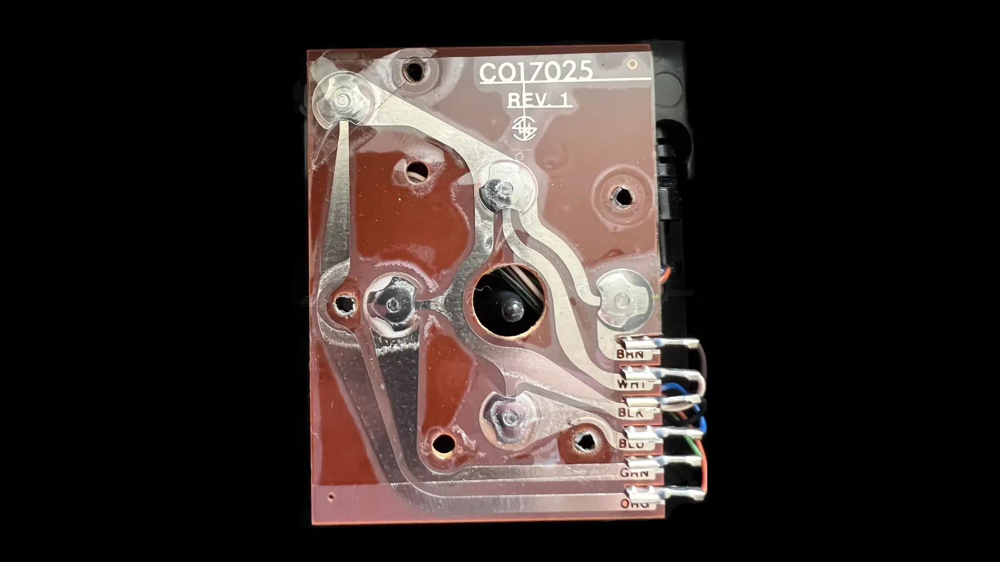

What follows is the first electronics mod I did as a child, with no artifacts to
show for it. Circa late 1980s.

We didn't have digital cameras back then and I didn't have the foresight to take
process photos using a regular camera, and didn't even think of keeping the
modded monstosity as a keepsake. You'll just have to take my word for it. All
images shown are others' photos from the Internet. Sigh.

### The priming

Growing up, we had an [Atari 2600 Video Game Console][1], with
[CX40 joysticks][2] to go with it. An issue with the joytics, or our forceful
usage of them was, the metal dome switches on the circuit board used to crack
and flatten, causing the joystick to malfunction towards one or more directions.

[1]: https://en.wikipedia.org/wiki/Atari_2600
[2]: https://en.wikipedia.org/wiki/Atari_CX40_joystick

  

My architect/photographer/audiophile dad wasn't shy of cracking open electronics
to do simple repairs. A single demonstration on how to open a joystick to unbend
and reposition the metal contacts launched me on my DIY electronics repair
journey. I performed all future joystick repairs.

The circuit board and its wiring was very simple to intuitively understand for
an uninitiated kid: Just 6 wires for ground, the 4 directions and the fire
button. (See: [Atari 2600 Field Service Manual, 7-1 & 7-2][3].)

[3]: https://archive.org/details/atari-2600-field-service-manual/page/n125/mode/2up

  

Photo lifted from <a href="https://forums.atariage.com/topic/346435-identify-if-cx40-is-genuine/#comment-5189662">a post</a> by Atari2600PAL on AtariAge

### The opportunity

Fast forward to many years later. I'm visiting my cousin and we're gaming on his
Commodore 64. My cousin has autofire joysticks, which I never bothered buying.
One of his autofire joysticks is physically broken and he was preparing to toss
it out in the garbage. I said I wanted to examine it and took it from him.
After my innate understanding of a standard non-autofire joystick, I was very
curious about what made these autofire joysticks tick.

I know nothing about electronics beyond "if you touch two metals, electricity
flows through them" at this point.

### The hack

I take the joystick home, unscrew the housing and start examinig the PCB. The
jostick is physically broken (I don't remember the specifics), but the PCB is
intact. Superimposing my knowledge of a basic joystick on top of the
incomprehensible circuit elements of the autofire PCB, I was able to
reverse-engineer this much: An extra +5V wire runs into the joystick. I use my
dad's circuit tester to verify. The contact parts are mostly the
same, but there's this island of circuity that must be the source of the
autofire.

https://www.c64-wiki.com/wiki/Quickshot
https://www.petervis.com/Sinclair/Commodore_Atari_Sinclair_Spectrum_Joystick/Commodore_Atari_Sinclair_Spectrum_Joystick_Inside.html

https://www.oldcomputr.com/spectravideo-quickshot-ii-1983/

https://www.rodusilighting.com.au/product-page/double-pole-push-button-switch
https://www.vintagecaravanspares.com.au/product-details/1149

And here's the literal hack: I hacksawed the autofire bit out of the broken
joystick, and soldered it into a non-autofire joystick (QuickShot I) that I was using with my
Atari ST. I ran a single wire I salvaged from on old headphone and superglued it
along the 6-pole wire of the standard joystick. I replaced the top fire button
of my joystick with a lamp toggle switch, which fit perfectly into the opening.
IT WORKED! I had a Frankenstein's monster of a joystick with an autofire circuit
retrofitted on it like a parasite. I had click the toggle switch on the top to
turn on autofire and click again to turn it off.

Courage, luck, success. Whatever confidence I had in all the other electronics
mods I did in later life, I trace back to this first hack.

Literal hack, with a hacksaw involved.
