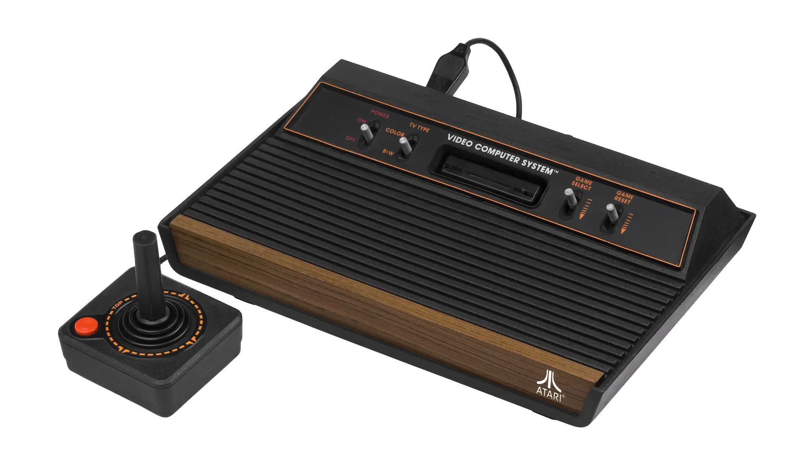
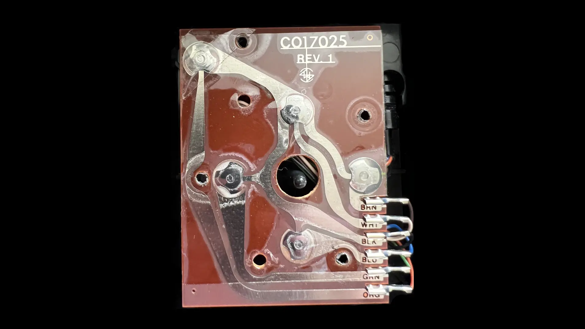
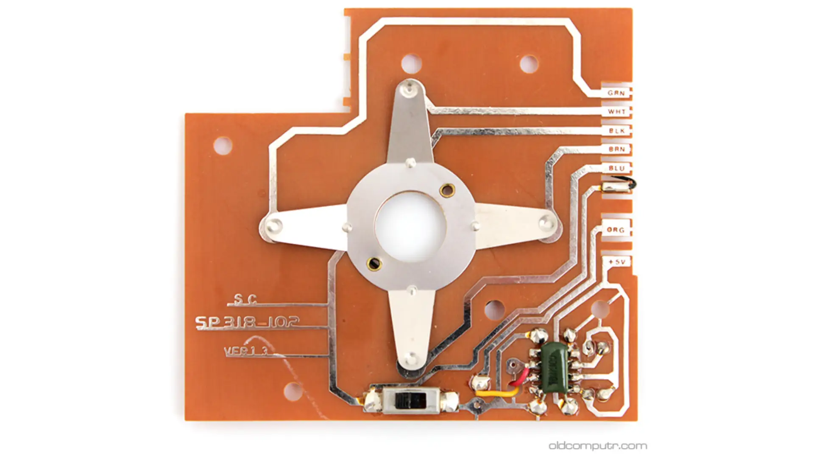
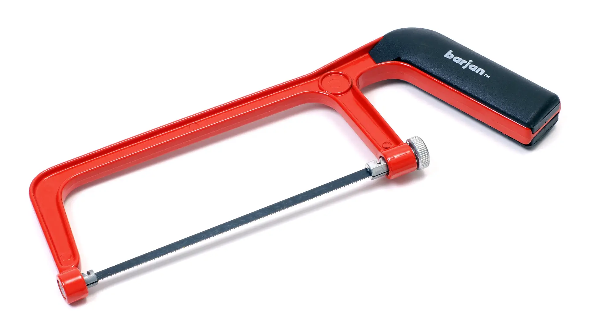

What follows is the first electronics mod I did as a child, with no artifacts to
show for it. Circa late 1980s.

We didn't have digital cameras back then and I didn't have the foresight to take
process photos using a regular camera, and didn't even think of preserving the
modded monstrosity as a keepsake. You'll just have to take my word for it.

### The priming

Growing up, we had an [Atari 2600 Video Game Console][1], with
[CX40 joysticks][2] to go with it. An issue with the joysticks, possibly due to
our forceful usage, was that the metal dome switches on the circuit board would
crack and flatten, causing the joystick to malfunction in one or more
directions.

[1]: https://en.wikipedia.org/wiki/Atari_2600
[2]: https://en.wikipedia.org/wiki/Atari_CX40_joystick

  

My architect/photographer/audiophile dad wasn't shy of cracking open electronics
to do simple repairs. A single demonstration on how to open a joystick to unbend
and reposition the metal contacts launched me on my DIY electronics repair
journey. I performed all future joystick repairs.

The circuit board and its wiring was very simple to intuitively understand for
an uninitiated kid: Just 6 wires for ground, the 4 directions and the fire
button. (See: [Atari 2600 Field Service Manual, 7-1 & 7-2][3].)

[3]: https://archive.org/details/atari-2600-field-service-manual/page/n125/mode/2up

  

Credit: Atari2600PAL, <a href="https://forums.atariage.com/topic/346435-identify-if-cx40-is-genuine/#comment-5189662">forum post on AtariAge</a>, used with permission.

### The opportunity

Fast forward to many years later. I'm visiting my cousin and we're gaming on his
Commodore 64. My cousin has autofire joysticks (a feature that allows a joystick
to automatically send repeated fire signals without the need for the user to
press the fire button repeatedly), which I never bothered buying.

One of his autofire joysticks is physically broken and he's thinking of tossing
it out in the garbage. I said I wanted to examine it and took it from him. Given
my understanding of a standard non-autofire joystick, I was very curious about
what made these autofire joysticks tick.

I know nothing about electronics beyond "if you touch two metals, electricity
flows through them" at this point.

### The inspection

I take the joystick home, unscrew the housing and start examining the circuit
board. Extrapolating my understanding of a basic joystick's circuit over the
incomprehensible circuit elements of the autofire circuit, I visually isolate
a section that is most likely responsible for the autofire action. I use my
dad's circuit tester to verify.

I don't remember the make and model, but it probably looked something like the
bottom right of this QuickShot II circuit board:

  

Credit: Giacomo Vernoni, <a href="https://www.oldcomputr.com/spectravideo-quickshot-ii-1983/">blog post on oldcomputr.com</a>, permission pending.

### The hack

And here's comes the hack.

  

I **hacksaw** the autofire section out of the circuit board, and franken-solder
it to the circuit board of my non-autofire [QuickShot I][4] joystick with wires
and tuck it sideways inside the joystick housing. I superglue a single wire
along the original 6-lead wire of the joystick to upgrade it to 7 leads. The
stripped end of this extra wire is inserted into the +5V hole of the female DE-9
connector. I replace the top fire button of my joystick with a pole push button,
which happens to fit perfectly in the shaft.

[4]: https://www.c64-wiki.com/wiki/Quickshot

  

Credit: Peter Vis, <a href="https://www.petervis.com/Sinclair/Commodore_Atari_Sinclair_Spectrum_Joystick/Commodore_Atari_Sinclair_Spectrum_Joystick_Inside.html">page on petervis.com</a>, permission pending.

**And it worked!**

I had a Frankenstein's monster of a joystick with an autofire circuit
retrofitted on it like a parasite. I was clicking the toggle switch on the top
to turn on autofire and clicking it again to turn it off.

Courage, luck, success. Whatever confidence I had for all the other electronics
mods I did in later life, I trace them back to this very first hack &mdash;
literal hack, with a hacksaw involved.
